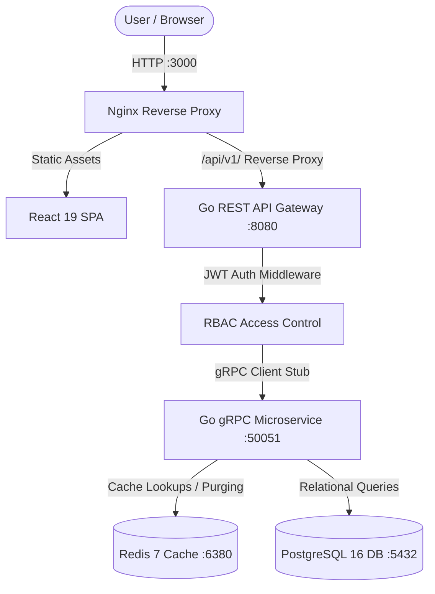

# 🛡️ Nexus Core — Enterprise User Management System

A production-grade, distributed **User Management System** engineered with **Go (Gin + gRPC)**, **PostgreSQL 16**, **Redis 7**, **React 19**, **TypeScript**, and **Docker**.

---

## 🏛️ System Architecture

```
                    ┌─────────────────────────────────────────┐
                    │          Client Browser / SPA           │
                    │       (React 19 + TypeScript + Vite)    │
                    └────────────────────┬────────────────────┘
                                         │ HTTP :3000
                                         ▼
                    ┌─────────────────────────────────────────┐
                    │      Nginx Reverse Proxy & Static       │
                    │   (Gzip, Security Headers, SPA Fallback)│
                    └────────────────────┬────────────────────┘
                                         │ HTTP :8080 (X-Request-ID)
                                         ▼
                    ┌─────────────────────────────────────────┐
                    │           REST API Gateway              │
                    │       (Go / Gin Web Framework)          │
                    │   - Request ID & Structured Logging     │
                    │   - CORS Preflight & Panic Recovery     │
                    │   - JWT Auth & Role-Based Access (RBAC) │
                    └────────────────────┬────────────────────┘
                                         │ gRPC Protobuf :50051
                                         ▼ (Outgoing Metadata Trace)
                    ┌─────────────────────────────────────────┐
                    │       User Management Microservice      │
                    │   (Go gRPC Server + Interceptor)        │
                    │   - UserService / DeptService / RoleSvc │
                    │   - Business Logic & Domain Invariants  │
                    │   - Bcrypt Hashing (Cost 10)            │
                    └───────────┬───────────────────┬─────────┘
                                │                   │
           Cache Hit / Miss     ▼                   ▼ SQL Transactions
     ┌──────────────────────────────┐   ┌──────────────────────────────┐
     │        Redis 7 Cache         │   │    PostgreSQL 16 Database    │
     │  - In-Memory User Caching    │   │  - Users, Depts, Roles       │
     │  - Invalidation on Mutation  │   │  - user_roles Junction Table │
     │  - Cascading Purge on Delete │   │  - ON DELETE SET NULL / CASCADE
     └──────────────────────────────┘   └──────────────────────────────┘
```



---

## ⚡ Core Architectural Invariants

1. **Strict Microservice Isolation**:
   The REST API Gateway **never** communicates with PostgreSQL or Redis directly. All persistence, data access, and domain validations are delegated to the internal gRPC microservice via generated Protobuf stubs (`proto/user.proto`).
2. **Zero Password Hash Leakage**:
   Password hashes are stored securely in PostgreSQL using `bcrypt` (cost 10). They are marked `json:"-"` in domain models and excluded from the Protobuf definition, ensuring password hashes can never be serialized over the wire or exposed in API responses.
3. **Distributed Cache Coherency**:
   User profile queries leverage a read-through Redis caching pattern with a 10-minute TTL (`latency < 1ms` on cache hits). All write operations (`PUT`, `DELETE`) immediately purge stale keys. Deleting a department or role automatically triggers cascading cache invalidation across all member users before applying PostgreSQL foreign key updates.
4. **Deterministic Sorting & SQL Injection Defense**:
   Dynamic `ORDER BY` column parameters are validated against a strict whitelist map (`allowedUserSortColumns`). Untrusted column inputs safely fall back to `u.id ASC`. All queries use a secondary deterministic tie-breaker (`, u.id ASC`) to eliminate pagination drift.

---

## 📂 Project Directory Structure

```
UserManagementSystem/
├── cmd/
│   ├── api/                     # REST API Gateway entrypoint (Gin)
│   │   ├── Dockerfile           # Multi-stage production container (24.5 MB)
│   │   └── main.go              # Router, middleware stack, gRPC client
│   └── user-service/            # Internal gRPC Microservice entrypoint
│       ├── Dockerfile           # Multi-stage production container (19.8 MB)
│       └── main.go              # gRPC server, connection pools, interceptor
├── internal/
│   ├── auth/                    # JWT TokenManager & bcrypt hashing
│   ├── cache/                   # Redis client & UserCache operations
│   ├── database/                # PostgreSQL connection pool initializer
│   ├── grpc/                    # gRPC server stubs, client wrappers & interceptors
│   ├── handler/                 # Gin HTTP controllers (User, Dept, Role, Auth)
│   ├── middleware/              # RequestID, Logger, CORS, Recovery, Auth, RBAC
│   ├── model/                   # Domain entities (User, Department, Role, Filters)
│   ├── repository/              # PostgreSQL data access layer (SQL queries)
│   ├── response/                # Centralized JSON envelope helpers
│   └── service/                 # Domain business logic & cache orchestration
├── migrations/                  # Database DDL migration scripts
│   ├── 000001_init_schema.up.sql
│   └── 000001_init_schema.down.sql
├── proto/                       # Protocol Buffer definitions & generated stubs
│   ├── user.proto
│   ├── user.pb.go
│   └── user_grpc.pb.go
├── tests/                       # Integration, E2E, and regression test suites
│   ├── api_quality_test.go
│   ├── auth_integration_test.go
│   ├── comprehensive_e2e_test.go
│   ├── department_integration_test.go
│   ├── e2e_rest_grpc_test.go
│   ├── pagination_search_test.go
│   └── role_integration_test.go
├── web/                         # React 19 Frontend Web Application
│   ├── Dockerfile               # Node 22 build -> Nginx Alpine runtime (26.4 MB)
│   ├── nginx.conf               # Reverse proxy routing, Gzip, and Security headers
│   ├── src/
│   │   ├── api/                 # Strongly typed fetch client & API interfaces
│   │   ├── components/          # Dashboard, Users, Departments, Roles, Login
│   │   ├── context/             # AuthContext with session persistence
│   │   ├── App.tsx              # Shell navigation & routing
│   │   └── index.css            # Modern design tokens & glassmorphism system
│   └── package.json
├── docker-compose.yml           # Unified multi-container deployment
├── .dockerignore                # Build context exclusion rules
├── .env.example                 # Environment variable template
├── go.mod / go.sum              # Go dependency manifests
└── main.go                      # Local multi-service launcher script
```

---

## 🔒 Security & Production Hardening Audit

Our system has been audited against the **OWASP Top 10**:

| Vulnerability Category | Mitigation in Nexus Core |
| :--- | :--- |
| **A01: Broken Access Control** | Server-side role enforcement via `RequireRole("Admin", "Manager")` middleware. Client-side RBAC assists the UX, but the API Gateway strictly validates JWT claims (`sub`, `roles`) on every request. |
| **A02: Cryptographic Failures** | Passwords hashed using `bcrypt` (cost 10). Cryptographic HMAC-SHA256 used for JWT signing. Zero hashes exposed in JSON envelopes or Protobuf stubs. |
| **A03: Injection** | 100% parameterized SQL queries using `$1, $2` placeholders. Dynamic `ORDER BY` clauses sanitized via strict whitelist mapping (`allowedUserSortColumns`). |
| **A04: Insecure Design** | Separation of concerns: Gateway handles HTTP ingress and rate limiting; gRPC microservice handles persistence. Cascading cache eviction ensures distributed coherency. |
| **A05: Security Misconfiguration** | Multi-stage Docker containers execute as unprivileged non-root users (`USER 10001:10001`). Internal gRPC port `50051` is isolated to the private Docker network. Nginx injects `X-Frame-Options: SAMEORIGIN`, `X-Content-Type-Options: nosniff`, and `X-XSS-Protection`. |
| **A07: Identification Failures** | Soft-deleted users are immediately locked out of authentication (`401 Unauthorized`). JWT expiration enforced via Unix timestamp validation. |
| **A09: Logging & Monitoring** | Every HTTP request receives an `X-Request-ID` (UUIDv4) that propagates via gRPC outgoing metadata to microservice interceptors for end-to-end distributed tracing. Panic recovery middleware intercepts crashes and sanitizes error envelopes. |

---

## 🚀 Quick Start (Docker Deployment)

Launch the entire 5-tier architecture with a single command:

```bash
# 1. Clone the repository
git clone https://github.com/your-org/UserManagementSystem.git
cd UserManagementSystem

# 2. Build and launch all containers
docker compose up -d --build
```

Verify service health:
```bash
docker compose ps
```

| Service | Address | Access Type | Description |
| :--- | :--- | :--- | :--- |
| **Frontend Web App** | `http://localhost:3000` | Public | React 19 SPA served via Nginx |
| **REST API Gateway** | `http://localhost:8080` | Public | Gin HTTP Gateway & Healthcheck |
| **gRPC Microservice** | `user-service:50051` | Private | Internal Microservice (Private Bridge) |
| **PostgreSQL 16** | `localhost:5432` | Internal / Dev | Relational Database Storage |
| **Redis 7** | `localhost:6380` | Internal / Dev | Distributed Cache & Session Layer |

---

## 🛠️ Local Development & Testing

### 1. Prerequisites
- **Go**: 1.24+
- **Node.js**: 22+ & `npm`
- **Docker**: Desktop or Engine with `docker compose`
- **Protocol Buffers**: `protoc` and `protoc-gen-go` / `protoc-gen-go-grpc`

### 2. Launch Infrastructure Services
```bash
docker compose up -d postgres redis
```

### 3. Run Backend Services
```bash
# Option A: Run the multi-service launcher script
go run main.go

# Option B: Run services individually
go run cmd/user-service/main.go
go run cmd/api/main.go
```

### 4. Run Frontend Development Server
```bash
cd web
npm install
npm run dev
# Vite runs at http://localhost:5173
```

### 5. Execute Test Suites
> **Note**: Always use `-p 1` to run tests sequentially and avoid database transaction collisions across packages.

```bash
# Run all backend unit and integration tests
go test -p 1 ./...

# Run the comprehensive E2E integration test suite
go test -v -p 1 -run TestComprehensive ./tests

# Run frontend TypeScript type-checking and build validation
cd web && npm run build
```

---

## 📖 API Reference

### Public Routes
| Method | Endpoint | Description |
| :--- | :--- | :--- |
| `GET` | `/health` | Gateway liveness & health status check |
| `POST` | `/api/v1/auth/login` | Authenticate with email/password to obtain a JWT Bearer token |

### Protected Routes (Requires `Authorization: Bearer <token>`)

#### User Management
| Method | Endpoint | Required Role | Description |
| :--- | :--- | :--- | :--- |
| `GET` | `/api/v1/users` | Any authenticated user | List users with pagination, multi-filter & search |
| `GET` | `/api/v1/users/:id` | Any authenticated user | Get single user by ID (cached via Redis) |
| `POST` | `/api/v1/users` | `Admin` or `Manager` | Create new user account |
| `PUT` | `/api/v1/users/:id` | `Admin` or `Manager` | Update existing user details & roles |
| `DELETE` | `/api/v1/users/:id` | `Admin` only | Soft-delete user account (`deleted_at IS NOT NULL`) |

#### Department Management
| Method | Endpoint | Required Role | Description |
| :--- | :--- | :--- | :--- |
| `GET` | `/api/v1/departments` | Any authenticated user | List all departments |
| `GET` | `/api/v1/departments/:id` | Any authenticated user | Get department by ID |
| `POST` | `/api/v1/departments` | `Admin` only | Create new department |
| `PUT` | `/api/v1/departments/:id` | `Admin` only | Update department details |
| `DELETE` | `/api/v1/departments/:id` | `Admin` only | Delete department (`ON DELETE SET NULL`) |

#### Role & RBAC Management
| Method | Endpoint | Required Role | Description |
| :--- | :--- | :--- | :--- |
| `GET` | `/api/v1/roles` | Any authenticated user | List all RBAC roles |
| `GET` | `/api/v1/roles/:id` | Any authenticated user | Get role by ID |
| `POST` | `/api/v1/roles` | `Admin` only | Create new role |
| `PUT` | `/api/v1/roles/:id` | `Admin` only | Update role definition |
| `DELETE` | `/api/v1/roles/:id` | `Admin` only | Delete role (`ON DELETE CASCADE`) |

---

## 📡 Standard Response Envelope

All API responses conform to a unified JSON format:

#### Success Response
```json
{
  "success": true,
  "data": {
    "id": 1,
    "name": "Jane Doe",
    "email": "jane@enterprise.com",
    "department": { "id": 2, "name": "Engineering" },
    "roles": [{ "id": 1, "name": "Admin" }],
    "status": "active"
  },
  "pagination": {
    "total_count": 45,
    "page": 1,
    "limit": 10,
    "total_pages": 5
  }
}
```

#### Error Response
```json
{
  "success": false,
  "error": {
    "code": "VALIDATION_FAILED",
    "message": "Password is required and must be at least 8 characters",
    "request_id": "7665268a-ce0f-42ff-8db8-4fb31ffea44d"
  }
}
```
